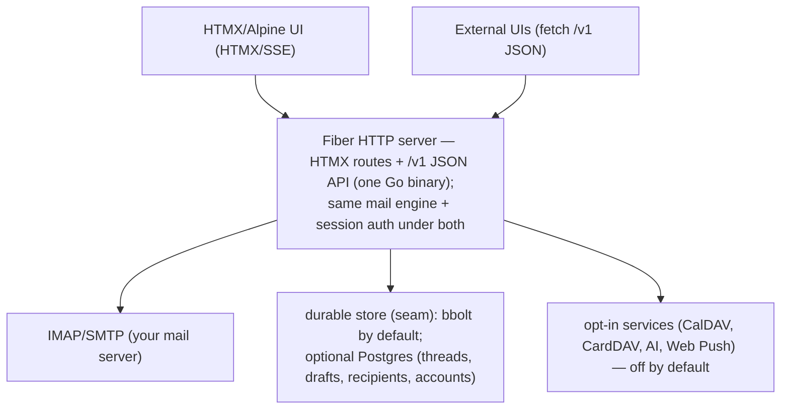

<div align="center">


**A lightweight, database-free PIM client — mail + calendar + contacts — in a single Go binary.**

[](LICENSE-MIT)
[](https://github.com/vul-os/lilmail/releases)
[](https://github.com/vul-os/lilmail/actions/workflows/ci.yml)

<br>


</div>

---

## What is lilmail?

lilmail is a self-hostable **PIM client** — mail, calendar, and contacts — that
connects to the **user's own** IMAP/SMTP + CalDAV + CardDAV account and ships as
**one self-contained Go binary**. The UI is server-rendered HTML (Go templates +
HTMX + Alpine.js) with every frontend asset embedded via `embed.FS` — no build
step, no CDN, and no external services to run by default. Drop the binary next to
a `config.toml` and it runs, comfortably, on 64 MB of RAM.

Log in with a classic username/password or **OAuth2 / OpenID Connect** (full
PKCE flow with XOAUTH2 and OAUTHBEARER SASL and automatic token refresh).
Everything beyond core mail — CalDAV calendar, CardDAV contacts, an AI mail
assistant, real-time notifications, Web Push, and multi-account support — is
opt-in via config keys and adds zero overhead when disabled.

lilmail is a fully **independent project** — think Evolution + Evolution-Data-
Server for the web. It talks to the **user's own** accounts (Gmail, Outlook, any
IMAP/CalDAV/CardDAV) over OAuth/password and exposes a stable **`/v1`** JSON API
(mail + `/v1/calendar` + `/v1/contacts`) that any rich client can build on.

## Features

- **Single binary (~30 MB), no external database** — templates and vendored JS
  embedded with `embed.FS`; durable state uses an embedded [bbolt](https://github.com/etcd-io/bbolt)
  file by default (nothing to run), with an **optional Postgres backend** for
  shared / multi-instance deploys; runs fully offline/air-gapped with only `config.toml`
- **IMAP** mailbox browsing and **SMTP** sending
- **JSON API** (`/v1`) — a clean REST surface (folders/labels, paginated
  messages, search, flags, move/archive/spam, delete, snooze, compose + drafts,
  attachment upload/download, scheduled send, calendar, contacts, settings) for
  rich clients, served alongside the HTMX UI from the same engine and the same
  session auth. See [docs/API.md](docs/API.md).
- **OAuth2 / OpenID Connect** — authorization-code flow, PKCE (S256), automatic
  refresh-token handling, XOAUTH2 and OAUTHBEARER SASL; password login still works
- **Conversation threading** — JWZ algorithm (`References` / `In-Reply-To` /
  `Message-ID`) backed by an embedded [bbolt](https://github.com/etcd-io/bbolt) store
- **Compose** — plain-text and HTML rich-text (contenteditable toolbar), file
  attachments (multipart/mixed MIME) with `cid:` inline images
  (multipart/related), scheduled send (send-later, `/v1`), drafts with 30-second
  auto-save plus IMAP APPEND/restore. Outgoing headers are guarded against
  CR/LF/NUL header injection
- **Recipient autocomplete** — recent-recipients store with optional CardDAV
  address-book lookup
- **Calendar (CalDAV) + meeting invites** — month/week views, event CRUD,
  free/busy, and end-to-end iTIP/iMIP invites (send a `METHOD:REQUEST`, parse a
  received invite, RSVP with `METHOD:REPLY`) — opt-in via `[caldav]`
- **Real-time notifications** — IMAP IDLE watcher, SSE stream, browser
  notifications, native desktop toasts, and VAPID Web Push — opt-in via `[notifications]`
- **AI mail assistant** — smart compose, thread summaries, reply suggestions,
  action-item extraction, and phishing detection via any OpenAI-compatible
  endpoint — opt-in via `[ai]`
- **Multiple accounts** — add/switch IMAP accounts and a unified inbox with
  concurrent fan-out and per-account error isolation — opt-in via `[accounts]`
- **Security-first** — JWT sessions, AES-256-GCM encrypted credentials at rest,
  strict Content-Security-Policy, `SameSite=Lax` cookies, sandboxed email iframe
- **Dark mode** — hand-written CSS, no CDN dependency
- Builds and runs on **Linux, macOS, and Windows**

## How it works

lilmail is a server-rendered [Fiber](https://gofiber.io/) application. There is
no SPA and no asset pipeline — HTML templates and vendored JS/CSS are compiled
into the binary at build time, and HTMX swaps in server-rendered partials so the
page never does a full reload.



State that must survive a restart (conversation threads, recent recipients,
extra-account credentials, VAPID keys, scheduled sends) lives in the durable
store — an embedded bbolt file by default, or a shared Postgres database when
configured; session credentials are AES-256-GCM encrypted. The same mail engine
backs both the server-rendered HTMX UI and the `/v1` JSON API. See
[docs/ARCHITECTURE.md](docs/ARCHITECTURE.md) for the request lifecycle and
[docs/API.md](docs/API.md) for the JSON API reference.

**Injected-credential mode (optional, off by default).** Normally lilmail holds
its own session and connects to the user's mailbox itself. As an option, an
embedding host (or the test harness) may inject the per-request connection spec as
`X-Vulos-Broker-Auth` + `X-Vulos-Mail-*` headers, so lilmail builds the IMAP/SMTP/
DAV client straight from the headers. Those headers only ever describe the **user's
own** account. The path is gated by a shared secret (`LILMAIL_BROKER_SECRET`,
matched in constant time): **if the secret is unset or mismatched, the headers are
ignored entirely** and the request falls back to normal session auth, so standalone
lilmail never trusts client-supplied connection headers. Each request's spec is
**copied out of the transport buffer** as it is parsed, so one request can never
mutate another's retained spec — per-account routing stays isolated even under a
pooled/concurrent server. See [docs/API.md](docs/API.md) → *Injected-credential
mode*.

## Quick start

```bash
# Clone
git clone https://github.com/vul-os/lilmail.git
cd lilmail

# Configure — copy the example and fill in your mail server details + secrets
cp config.toml.example config.toml   # then edit

# Run
go run main.go            # or: make build && ./lilmail
```

Open **http://localhost:3000** and sign in.

Prefer a pre-built binary? Grab the latest archive from
[Releases](https://github.com/vul-os/lilmail/releases) — only `config.toml`
needs to be present alongside it.

## Configuration

All configuration lives in `config.toml`. A minimal setup needs only an IMAP
server and a couple of secrets:

```toml
[server]
port = 3000

[imap]
server = "mail.example.com"
port   = 993
tls    = true

[smtp]
# Derived from the IMAP server if omitted
port         = 587
use_starttls = true

[jwt]
secret = "your-secure-jwt-secret"

[encryption]
key = "your-32-character-encryption-key"   # exactly 32 chars (AES-256)
```

Optional sections — `[oauth2]`, `[ssl]`, `[notifications]`, `[caldav]`,
`[carddav]`, `[ai]`, `[accounts]` — are all default-disabled. See
[`config.toml.example`](config.toml.example) for an annotated reference of every
key, or [docs/CONFIGURATION.md](docs/CONFIGURATION.md) for the full walkthrough.

## Documentation

| Document | Description |
|----------|-------------|
| [docs/GETTING-STARTED.md](docs/GETTING-STARTED.md) | Installation, first-run, and basic configuration walkthrough |
| [docs/ARCHITECTURE.md](docs/ARCHITECTURE.md) | Code layout, request lifecycle, and subsystem overview |
| [docs/API.md](docs/API.md) | `/v1` JSON API reference — endpoints, auth, payloads |
| [docs/CONFIGURATION.md](docs/CONFIGURATION.md) | Complete `config.toml` reference — every key, section, and default |
| [docs/SCREENSHOTS.md](docs/SCREENSHOTS.md) | Screenshot gallery and how to regenerate them |
| [ROADMAP.md](ROADMAP.md) | Shipped features, planned work, and exploratory ideas |
| [CHANGELOG.md](CHANGELOG.md) | Per-release changelog (Keep a Changelog format) |

## Screenshots

| Login | Inbox | Message view |
|-------|-------|--------------|
|  |  |  |

| Compose | Settings | Search |
|---------|----------|--------|
|  |  |  |

See [docs/SCREENSHOTS.md](docs/SCREENSHOTS.md) for the full gallery and how to
regenerate screenshots.

## Development

```bash
make build         # go build -o lilmail .
make test          # go test ./...
make vet           # go vet ./...
make check         # build + vet + test
go run main.go     # run (requires config.toml)
./lilmail -version # print version and exit
```

Cross-compile for any supported platform:

```bash
GOOS=linux   GOARCH=amd64 go build -o lilmail-linux-amd64
GOOS=darwin  GOARCH=arm64 go build -o lilmail-darwin-arm64
GOOS=windows GOARCH=amd64 go build -o lilmail-windows-amd64.exe
```

### Regenerate screenshots

```bash
make screenshots        # boots lilmail + runs the Playwright screenshotter
make demo-screenshots   # uses the in-memory demo inbox — no IMAP/SMTP needed
```

Requires Node 18+ and Playwright Chromium. See
[docs/SCREENSHOTS.md](docs/SCREENSHOTS.md) for which screenshots need a live IMAP
account.

## Contributing

Contributions are welcome. Please open an issue to discuss substantial changes
before sending a pull request, and make sure the following passes first:

```bash
make check   # go build ./... && go vet ./... && go test ./...
```

## License

[MIT](LICENSE-MIT) OR [Apache-2.0](LICENSE-APACHE) — © VulOS. lilmail is a VulOS
project; source and issues at [github.com/vul-os/lilmail](https://github.com/vul-os/lilmail).

### Third-party notices

lilmail redistributes third-party software: Go modules compiled into the binary,
and the vendored JavaScript (htmx, Alpine.js) served to the browser. Their
licences (MIT, BSD, ISC, Apache-2.0) require the copyright notice and licence
text to accompany every copy, so lilmail ships them:

- [THIRD-PARTY-NOTICES.txt](THIRD-PARTY-NOTICES.txt) — name, version, licence and
  full licence text for every component. Generated from the real dependency graph
  by `make notices` (`scripts/gen-notices.sh`); never hand-edited.
- A running lilmail serves it at **`/licenses.txt`**, linked from the login page
  and from Settings → About.
- Each vendored bundle also has its upstream licence next to it, e.g.
  `assets/vendor/htmx.min.js.LICENSE`.

---

<sub> · <strong>Built with purpose. Open by design.</strong></sub>

---

<p align="center">
  <a href="https://vulos.org"></a><br>
  <sub><a href="https://vulos.org"><b>vulos</b></a> — open by design</sub>
</p>
