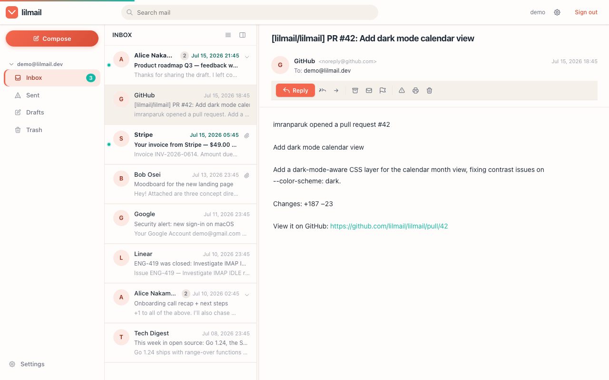
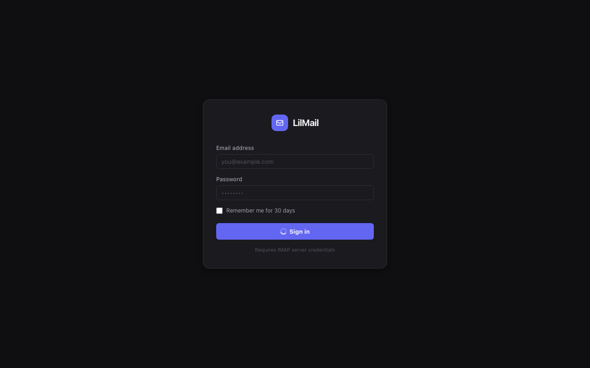
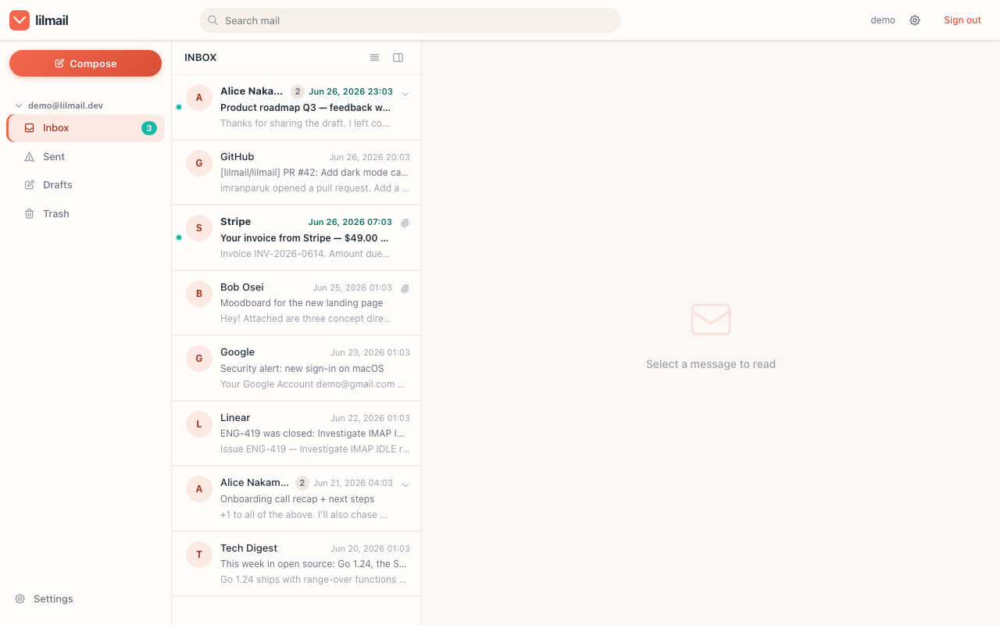
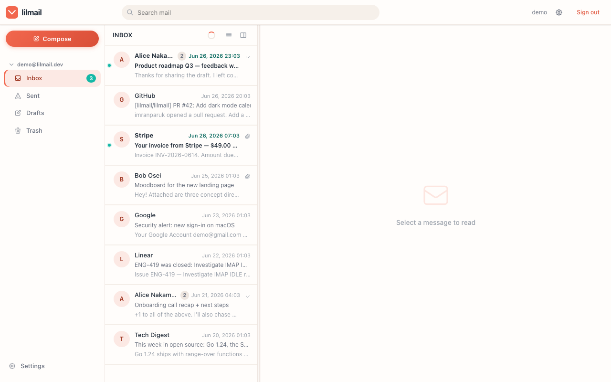
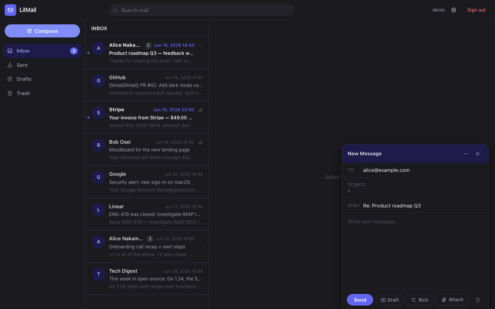
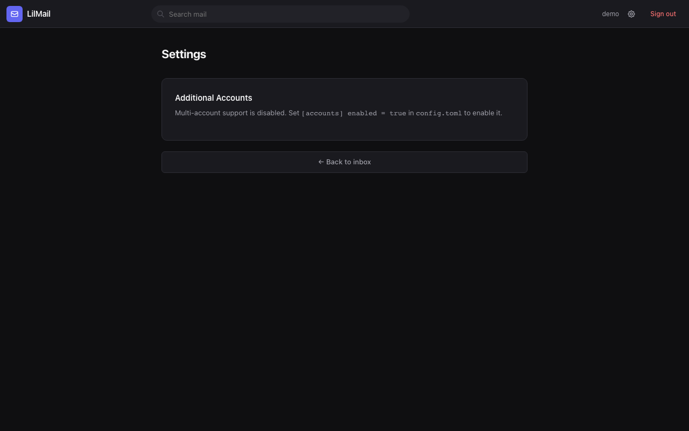
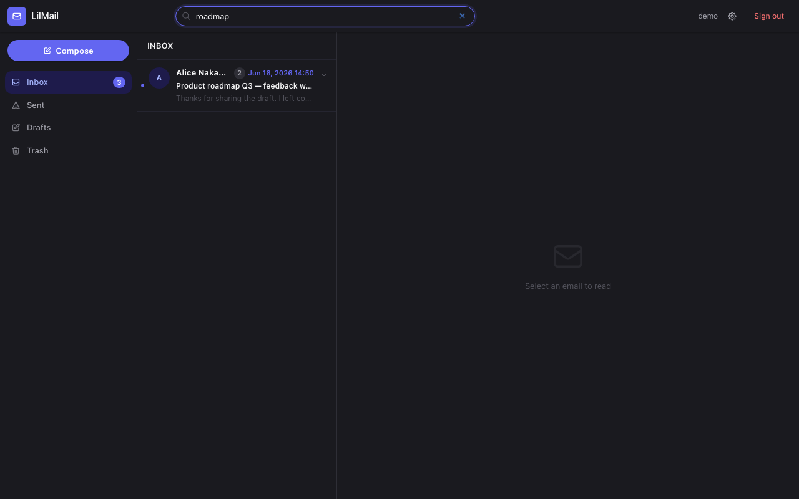

<div align="center">


**A lightweight, database-free webmail client in a single Go binary.**

[](LICENSE)
[](https://github.com/exolutionza/lilmail/releases)
[](https://github.com/exolutionza/lilmail/actions/workflows/ci.yml)

<sub> Part of <strong><a href="https://vulos.org">VulOS</a></strong> — the open, self-hostable web OS &amp; app suite. Runs standalone, or combined under one login by <a href="https://vulos.org">Vulos Workspace</a>.</sub>

<br>



</div>

---

## What is lilmail?

lilmail is a self-hostable webmail client that connects to any IMAP/SMTP
mailbox and ships as **one self-contained Go binary**. The UI is server-rendered
HTML (Go templates + HTMX + Alpine.js) with every frontend asset embedded via
`embed.FS` — no build step, no CDN, and no external services to run by default.
Drop the binary next to a `config.toml` and it runs, comfortably, on 64 MB of RAM.

Log in with a classic username/password or **OAuth2 / OpenID Connect** (full
PKCE flow with XOAUTH2 and OAUTHBEARER SASL and automatic token refresh).
Everything beyond core mail — CalDAV calendar, CardDAV contacts, an AI mail
assistant, real-time notifications, Web Push, and multi-account support — is
opt-in via config keys and adds zero overhead when disabled.

## Part of VulOS

[VulOS](https://vulos.org) is an open, self-hostable web OS + app suite. Each
product is self-hostable on its own and can be combined under one login by
**Vulos Workspace**:

- **Vulos Mail** — mail + calendar + contacts (engine: **lilmail**; UI: `@vulos/mail-ui`; server: vulos-mail)
- **Vulos Talk** — team chat + channels/Spaces + huddles
- **Vulos Meet** — video meetings (LiveKit SFU)
- **Vulos Office** — documents: docs, sheets, slides, PDF
- **Vulos Relay** — sovereign connectivity fabric (`@vulos/relay-client`)
- **Vulos Workspace** — the open suite shell (one login, app switcher, admin)
- **Vulos OS** — the web-native desktop

**lilmail** is the **engine of the Vulos Mail product** (mail + calendar +
contacts): a complete IMAP/SMTP webmail client that also exposes a clean `/v1`
JSON API consumed by the shared `@vulos/mail-ui` React components and the
vulos-mail server. It runs standalone **and** is combined by Vulos Workspace.
Products link/embed each other only through clean seams (here, the `/v1` HTTP
contract) — they never import one another's code.

## Features

- **Single binary, no external database** — templates and vendored JS embedded
  with `embed.FS`; durable state uses an embedded [bbolt](https://github.com/etcd-io/bbolt)
  file by default (nothing to run), with an **optional Postgres backend** for
  shared / multi-instance deploys; runs fully offline/air-gapped with only `config.toml`
- **IMAP** mailbox browsing and **SMTP** sending
- **JSON API** (`/v1`) — a clean REST surface (folders, messages, search, flags,
  delete) for rich clients, served alongside the HTMX UI from the same engine and
  the same session auth. Powers the Vulos Mail React webmail and Vulos Workspace.
- **OAuth2 / OpenID Connect** — authorization-code flow, PKCE (S256), automatic
  refresh-token handling, XOAUTH2 and OAUTHBEARER SASL; password login still works
- **Conversation threading** — JWZ algorithm (`References` / `In-Reply-To` /
  `Message-ID`) backed by an embedded [bbolt](https://github.com/etcd-io/bbolt) store
- **Compose** — plain-text and HTML rich-text (contenteditable toolbar), file
  attachments (multipart/mixed MIME), drafts with 30-second auto-save plus IMAP
  APPEND/restore
- **Recipient autocomplete** — recent-recipients store with optional CardDAV
  address-book lookup
- **Calendar (CalDAV)** — month/week views, event creation, and iTIP RSVP from
  invite attachments — opt-in via `[caldav]`
- **Real-time notifications** — IMAP IDLE watcher, SSE stream, browser
  notifications, native desktop toasts, and VAPID Web Push — opt-in via `[notifications]`
- **AI mail assistant** — smart compose, thread summaries, reply suggestions,
  action-item extraction, and phishing detection via any OpenAI-compatible
  endpoint — opt-in via `[ai]`
- **Multiple accounts** — add/switch IMAP accounts and a unified inbox with
  concurrent fan-out and per-account error isolation — opt-in via `[accounts]`
- **Security-first** — JWT sessions, AES-256-GCM encrypted credentials at rest,
  strict Content-Security-Policy, `SameSite=Lax` cookies, sandboxed email iframe
- **Dark mode** — hand-written CSS, no CDN dependency
- Builds and runs on **Linux, macOS, and Windows**

## How it works

lilmail is a server-rendered [Fiber](https://gofiber.io/) application. There is
no SPA and no asset pipeline — HTML templates and vendored JS/CSS are compiled
into the binary at build time, and HTMX swaps in server-rendered partials so the
page never does a full reload.

```
 HTMX/Alpine UI ─┐                        ┌─ React clients (Vulos Mail, Workspace)
   (HTMX/SSE)    │                        │   (fetch JSON)
                 ▼                        ▼
            Fiber HTTP server ──  HTMX routes  +  /v1 JSON API  (one Go binary)
                              │   (same mail engine + session auth under both)
        ┌─────────────────────┼─────────────────────┐
        │                     │                     │
     IMAP/SMTP        durable store (seam)     opt-in services
  (your mail server)  bbolt by default;       (CalDAV, CardDAV, AI,
                      optional Postgres        Web Push) — off by default
                      (threads, drafts,
                       recipients, accounts)
```

State that must survive a restart (conversation threads, recent recipients,
extra-account credentials, VAPID keys) lives in the durable store — an embedded
bbolt file by default, or a shared Postgres database when configured; session
credentials are AES-256-GCM encrypted. The same mail engine backs both the
server-rendered HTMX UI and the `/v1` JSON API. See
[docs/ARCHITECTURE.md](docs/ARCHITECTURE.md) for the request lifecycle and
[docs/API.md](docs/API.md) for the JSON API reference.

## Quick start

```bash
# Clone
git clone https://github.com/exolutionza/lilmail.git
cd lilmail

# Configure — copy the example and fill in your mail server details + secrets
cp config.toml.example config.toml   # then edit

# Run
go run main.go            # or: make build && ./lilmail
```

Open **http://localhost:3000** and sign in.

Prefer a pre-built binary? Grab the latest archive from
[Releases](https://github.com/exolutionza/lilmail/releases) — only `config.toml`
needs to be present alongside it.

## Configuration

All configuration lives in `config.toml`. A minimal setup needs only an IMAP
server and a couple of secrets:

```toml
[server]
port = 3000

[imap]
server = "mail.example.com"
port   = 993
tls    = true

[smtp]
# Derived from the IMAP server if omitted
port         = 587
use_starttls = true

[jwt]
secret = "your-secure-jwt-secret"

[encryption]
key = "your-32-character-encryption-key"   # exactly 32 chars (AES-256)
```

Optional sections — `[oauth2]`, `[ssl]`, `[notifications]`, `[caldav]`,
`[carddav]`, `[ai]`, `[accounts]` — are all default-disabled. See
[`config.toml.example`](config.toml.example) for an annotated reference of every
key, or [docs/CONFIGURATION.md](docs/CONFIGURATION.md) for the full walkthrough.

## Documentation

| Document | Description |
|----------|-------------|
| [docs/GETTING-STARTED.md](docs/GETTING-STARTED.md) | Installation, first-run, and basic configuration walkthrough |
| [docs/ARCHITECTURE.md](docs/ARCHITECTURE.md) | Code layout, request lifecycle, and subsystem overview |
| [docs/API.md](docs/API.md) | `/v1` JSON API reference — endpoints, auth, payloads |
| [docs/CONFIGURATION.md](docs/CONFIGURATION.md) | Complete `config.toml` reference — every key, section, and default |
| [docs/SCREENSHOTS.md](docs/SCREENSHOTS.md) | Screenshot gallery and how to regenerate them |
| [ROADMAP.md](ROADMAP.md) | Shipped features, planned work, and exploratory ideas |
| [CHANGELOG.md](CHANGELOG.md) | Per-release changelog (Keep a Changelog format) |

## Screenshots

| Login | Inbox | Message view |
|-------|-------|--------------|
|  |  |  |

| Compose | Settings | Search |
|---------|----------|--------|
|  |  |  |

See [docs/SCREENSHOTS.md](docs/SCREENSHOTS.md) for the full gallery and how to
regenerate screenshots.

## Development

```bash
make build         # go build -o lilmail .
make test          # go test ./...
make vet           # go vet ./...
make check         # build + vet + test
go run main.go     # run (requires config.toml)
./lilmail -version # print version and exit
```

Cross-compile for any supported platform:

```bash
GOOS=linux   GOARCH=amd64 go build -o lilmail-linux-amd64
GOOS=darwin  GOARCH=arm64 go build -o lilmail-darwin-arm64
GOOS=windows GOARCH=amd64 go build -o lilmail-windows-amd64.exe
```

### Regenerate screenshots

```bash
make screenshots        # boots lilmail + runs the Playwright screenshotter
make demo-screenshots   # uses the in-memory demo inbox — no IMAP/SMTP needed
```

Requires Node 18+ and Playwright Chromium. See
[docs/SCREENSHOTS.md](docs/SCREENSHOTS.md) for which screenshots need a live IMAP
account.

## Contributing

Contributions are welcome. Please open an issue to discuss substantial changes
before sending a pull request, and make sure the following passes first:

```bash
make check   # go build ./... && go vet ./... && go test ./...
```

## License

Released under the **MIT License** — see [LICENSE](LICENSE).
