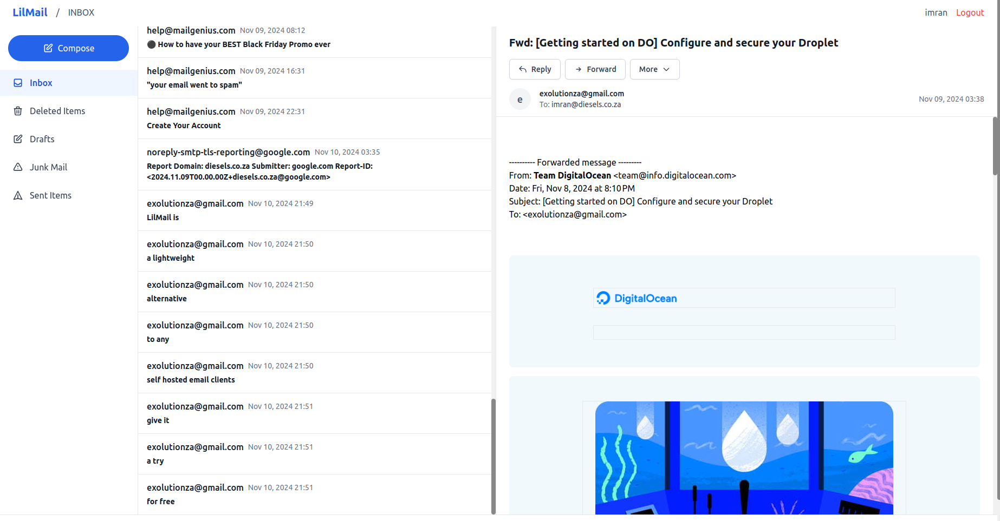

<div align="center">

# LilMail 📧

**A lightweight, database-free webmail client written in Go.**

Connect to any IMAP/SMTP mailbox — with password *or* OAuth2 login — from a fast,
server-rendered web UI that runs comfortably on 64 MB of RAM.

[](https://github.com/exolutionza/lilmail/actions/workflows/release.yml)
[](https://github.com/exolutionza/lilmail/actions/workflows/ci.yml)
[](https://github.com/exolutionza/lilmail/releases)
[](go.mod)
[](LICENSE)
[](https://github.com/vul-os)

> 🧩 LilMail is part of **[Vula OS](https://github.com/vul-os)** — a suite of
> small, self-hostable, privacy-respecting building blocks.



</div>

---

## Table of contents

- [Why LilMail](#-why-lilmail)
- [Features](#-features)
- [Requirements](#️-requirements)
- [Quick start](#-quick-start)
- [Configuration](#️-configuration)
- [OAuth2 / OpenID Connect login](#-oauth2--openid-connect-login)
- [Calendar (CalDAV)](#-calendar-caldav)
- [Notifications](#-notifications)
- [Building & releasing](#️-building--releasing)
- [Roadmap](#️-roadmap)
- [Contributing](#-contributing)
- [License](#-license)

## ✨ Why LilMail

Most webmail clients want a database, a message queue, and a beefy server.
LilMail is the opposite: a **single Go binary** with a **file-based cache**,
designed to be the simple, self-hosted webmail front end you actually enjoy
running. It's growing toward a lean **Thunderbird alternative** for the
browser — see the [Roadmap](ROADMAP.md).

## 🚀 Features

- 🪶 **Single binary, no database** — all state lives on disk; templates and
  frontend assets are embedded so the binary runs **fully offline / air-gapped**
  without any companion files
- 📥 **IMAP** mailbox browsing & 📤 **SMTP** sending
- 🔐 **Two ways to log in:**
  - Classic username / password
  - **OAuth2 / OpenID Connect** with **XOAUTH2** *and* **OAUTHBEARER** SASL for
    both IMAP and SMTP — full authorization-code flow, **PKCE**, and automatic
    **refresh-token** handling
- 🧾 Full-email-as-username support for servers that expect the whole address
- 🔒 **JWT** sessions and **AES-GCM** encrypted credentials/tokens at rest
- 💾 File-based caching — reliable, dependency-free
- 🧵 **Conversation threading** — messages are grouped into conversations using
  the **JWZ algorithm** (`References` / `In-Reply-To` / `Message-ID`), backed
  by an embedded bbolt store
- 📅 **Calendar (CalDAV)** — browse and create events from any CalDAV-compatible
  server (see [Calendar](#-calendar-caldav) below)
- 🔔 **Real-time notifications** — new-mail browser notifications via SSE + the
  Web Notifications API while a tab is open; opt-in native desktop toasts
  (see [Notifications](#-notifications) below)
- 🖥️ Server-rendered UI (Go templates + HTMX + Alpine + Tailwind), no SPA build
- 🌍 Runs on Linux, macOS, and Windows

## 🖥️ Requirements

| Resource | Recommendation |
| -------- | -------------- |
| Memory   | 64 MB RAM minimum |
| Storage  | ~1 GB for cache (depends on mailbox size) |
| Go       | 1.21+ (to build from source) |
| OS       | Linux, macOS, or Windows |

## 🏁 Quick start

```bash
# Clone
git clone https://github.com/exolutionza/lilmail.git
cd lilmail

# Configure (see below)
cp config.toml my-config.toml   # then edit

# Run
go run main.go
```

Then open the webmail interface at **http://localhost:3000** (the default port).

> Prefer a binary? Grab the latest archive from
> [Releases](https://github.com/exolutionza/lilmail/releases) — the binary is
> fully self-contained (templates and vendor JS are embedded); only `config.toml`
> needs to be present alongside it.

## ⚙️ Configuration

LilMail reads `config.toml` from the working directory. Minimal example:

```toml
[server]
port = 3000
username_is_email = true   # send the full email address as the IMAP/SMTP username

[imap]
server = "imap.example.com"
port = 993
tls = true

[smtp]
# Derived from the IMAP server when omitted (imap.* → smtp.*)
server = "smtp.example.com"
port = 587
use_starttls = true

[cache]
folder = "./cache"

[jwt]
secret = "change-me-to-a-long-random-string"

[encryption]
key = "a-32-character-encryption-key!!"   # must be exactly 32 bytes
```

### Reference

| Section | Key | Description |
| ------- | --- | ----------- |
| `[server]` | `port` | HTTP port (default `3000`) |
| | `username_is_email` | Use the full email as the login username (default `true`) |
| `[imap]` | `server`, `port`, `tls` | IMAP host, port (usually `993`), and TLS |
| `[smtp]` | `server`, `port`, `use_starttls` | SMTP host, port (`587` STARTTLS / `465` TLS) |
| | `insecure_skip_verify` | Skip TLS certificate verification — for self-signed certs only (default `false`) |
| `[cache]` | `folder` | Directory for the on-disk cache |
| `[jwt]` | `secret` | Secret used to sign session tokens — **change in production** |
| `[encryption]` | `key` | 32-byte key for AES-GCM encryption — **change in production** |
| `[ssl]` | `enabled`, `cert_file`, `key_file`, … | Optional HTTPS termination + HSTS |
| `[oauth2]` | see [below](#-oauth2--openid-connect-login) | Optional OAuth2 / OIDC login |
| `[caldav]` | see [below](#-calendar-caldav) | Optional CalDAV calendar integration |
| `[notifications]` | see [below](#-notifications) | Optional real-time new-mail notifications |

## 🔑 OAuth2 / OpenID Connect login

Many mail servers (and providers like Gmail, Microsoft 365, Fastmail, or a
self-hosted Dovecot/Postfix behind Authentik/Keycloak) require **OAuth2** tokens
rather than passwords. LilMail supports this end-to-end: it runs the
authorization-code flow (with PKCE), stores the encrypted tokens in the session,
refreshes them automatically, and presents the access token to IMAP and SMTP via
the **XOAUTH2** or **OAUTHBEARER** SASL mechanism.

Enable it in `config.toml`:

```toml
[oauth2]
enabled = true
client_id = "lilmail"
client_secret = "your-oauth2-client-secret"   # leave empty for public PKCE clients
auth_url  = "https://auth.example.com/application/o/authorize/"
token_url = "https://auth.example.com/application/o/token/"
# Optional — used to resolve the email. If omitted, it's read from the id_token,
# so request the "openid email" scopes.
userinfo_url = "https://auth.example.com/application/o/userinfo/"
redirect_url = "https://yourdomain.com/auth/oauth/callback"
scopes = ["openid", "email", "profile"]
mechanism = "xoauth2"     # "xoauth2" or "oauthbearer"
email_claim = "email"     # which claim holds the address
use_pkce = true           # recommended
```

When enabled, a **“Sign in with OAuth2”** button appears on the login page;
password login keeps working alongside it. Register
`https://yourdomain.com/auth/oauth/callback` as the redirect URI with your
provider.

## 📅 Calendar (CalDAV)

LilMail can connect to any **CalDAV**-compatible server (Nextcloud, Baikal,
Fastmail, iCloud, etc.) to display a month/week calendar and create events. The
calendar navigation link appears in the sidebar only when CalDAV is enabled.

Enable it in `config.toml`:

```toml
[caldav]
enabled  = true
url      = "https://cal.example.com/dav/"  # CalDAV endpoint or principal URL
auth     = "basic"                         # "basic" or "oauth2"
username = "alice@example.com"             # used when auth = "basic"
password = "app-password"                  # used when auth = "basic"
```

| Key | Description |
| --- | ----------- |
| `enabled` | Master switch — set `true` to show calendar routes and the nav link |
| `url` | CalDAV endpoint or well-known discovery URL |
| `auth` | Authentication method: `basic` (username + password) or `oauth2` (uses the logged-in user's OAuth2 token) |
| `username` | Basic-auth username (ignored when `auth = "oauth2"`) |
| `password` | Basic-auth password (ignored when `auth = "oauth2"`) |

LilMail also detects **iCalendar (`.ics`) invite attachments** in the mail
viewer and shows a basic RSVP affordance.

## 🔔 Notifications

LilMail can alert you of new mail in real time while a browser tab is open, and
optionally show native desktop toasts when running locally.

Enable it in `config.toml`:

```toml
[notifications]
enabled = true   # master switch; must be true to activate anything
idle    = true   # IMAP IDLE watcher (recommended; falls back to NOOP poll)
desktop = false  # native OS toast via gen2brain/beeep (local/desktop runs only)
```

| Key | Description |
| --- | ----------- |
| `enabled` | Master switch — `false` by default; no extra goroutines or routes are created when disabled |
| `idle` | Start an IMAP IDLE watcher per session to detect new mail in real time (default `true` when enabled) |
| `desktop` | Show native OS toasts via `gen2brain/beeep` — useful when running the binary as a local desktop app (default `false`) |

When `enabled = true`, the browser will request the **Web Notifications
permission** on first login. New-mail notifications (sender + subject) are
delivered while the tab is open via **Server-Sent Events (SSE)**. There is no
background push when no tab is open (Web Push / VAPID is not yet implemented).

## 🏗️ Building & releasing

```bash
# Current platform
go build -o lilmail

# Cross-compile
GOOS=linux   GOARCH=amd64 go build -o lilmail-linux-amd64
GOOS=windows GOARCH=amd64 go build -o lilmail-windows-amd64.exe
GOOS=darwin  GOARCH=amd64 go build -o lilmail-darwin-amd64

# Print version info
./version.sh
```

**Versioning.** LilMail follows [Semantic Versioning](https://semver.org/).
Releases are cut by pushing a `vX.Y.Z` tag; the
[`Release` workflow](.github/workflows/release.yml) then builds Linux, Windows,
and macOS archives (plus a source archive) and publishes them to
[GitHub Releases](https://github.com/exolutionza/lilmail/releases).

```bash
git tag v1.0.8
git push origin v1.0.8
```

## 🗺️ Roadmap

Search, JMAP, CardDAV, multiple accounts, a Nix module, and more are tracked in
**[ROADMAP.md](ROADMAP.md)**. JWZ threading, CalDAV calendar, and real-time
notifications are already shipped — see the sections above.

## 🤝 Contributing

Contributions are welcome! Please open an issue to discuss substantial changes
first, then send a pull request. Before submitting:

```bash
go build ./... && go vet ./... && go test ./...
```

## 📄 License

Released under the **MIT License** — see [LICENSE](LICENSE).
