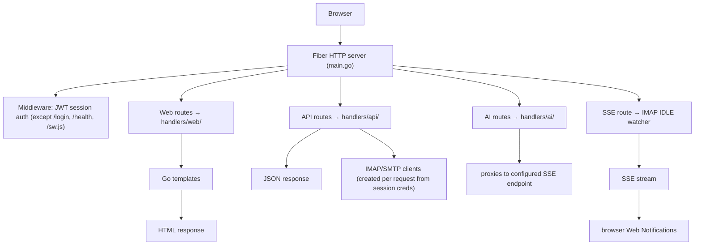

# Architecture

lilmail is a server-rendered Go web application using the
[Fiber](https://gofiber.io/) HTTP framework. All frontend assets and HTML
templates are embedded in the binary at build time via `embed.FS` — no static
file server or separate asset pipeline is required.

## Repository layout

```
lilmail/
├── main.go                  # Entry point: config, DI wiring, route registration
├── config/
│   ├── config.go            # Config structs + TOML loader
│   └── config_test.go
├── handlers/
│   ├── ai/                  # AI mail assistant endpoints
│   ├── api/                 # Mail ENGINE: IMAP/SMTP client, MIME, threading, CalDAV
│   ├── jsonapi/             # /v1 JSON REST API over the engine (for external UIs)
│   └── web/                 # HTML page handlers (inbox, viewer, settings, …) — HTMX
├── models/
│   ├── email.go             # Email, Attachment, Thread, Invite model types
│   ├── calendar.go          # CalDAV event types
│   └── contact.go           # CardDAV contact types
├── storage/
│   ├── session.go           # bbolt-backed session/credential store
│   ├── kv.go                # Durable KV seam + backend selector (Open)
│   ├── bolt.go              # Embedded bbolt backend (default)
│   ├── postgres.go          # Optional shared Postgres backend (opt-in)
│   └── object.go            # Optional shared-object (S3) seam — attachment cache only
├── sessions/                # Runtime session state (file-based)
├── utils/
│   └── cache.go             # On-disk cache helpers
├── templates/               # Go HTML templates
│   ├── layouts/main.html    # Shared app shell (nav, sidebar, top bar)
│   ├── partials/            # HTMX partial fragments (email-list, compose, …)
│   ├── inbox.html
│   ├── login.html
│   ├── settings.html
│   ├── calendar.html
│   └── calendar-week.html
├── assets/
│   ├── css/mail.css         # Hand-written CSS (dark mode, responsive)
│   ├── vendor/              # htmx.min.js, alpine.min.js (+ their .LICENSE files)
│   └── sw.js                # Service worker (Web Push)
├── scripts/                 # Developer tooling (Playwright screenshotter)
├── docs/                    # Documentation and screenshots
├── .github/workflows/       # CI + release pipelines
├── config.toml.example
├── go.mod / go.sum
└── tmpl_smoke_test.go       # Template parse smoke test
```

## Request lifecycle



## Key subsystems

### Authentication

`handlers/web/auth.go` (and `handlers/web/oauth.go`) handle login/logout.
Credentials are encrypted with AES-256-GCM (`[encryption].key`) before being
stored in the JWT session. The JWT is signed with `[jwt].secret` and stored in
a `SameSite=Lax` HTTP-only cookie (`Secure` when `[server].secure_cookies =
true`).

OAuth2: lilmail runs the full authorization-code flow with PKCE. After callback,
the access + refresh tokens are encrypted and stored in the session exactly like
passwords. Token refresh happens transparently on the next IMAP/SMTP operation
that receives a 401/NO AUTHENTICATE.

### IMAP / SMTP

`handlers/api/email.go` creates IMAP clients from session credentials on each
request using `emersion/go-imap`. There is no persistent connection pool —
connections are opened, used, and closed per request. This keeps memory usage
low and makes the server stateless with respect to IMAP state.

SMTP sending lives in `handlers/api/stmpClient.go`, with the outgoing MIME
assembled by `handlers/api/mime_builder.go` (multipart/mixed + multipart/related
`cid:` inline images, with every structured header value screened against CR/LF/
NUL injection). The SASL mechanism (plain, XOAUTH2, or OAUTHBEARER) is chosen
based on `[oauth2].mechanism`.

### Caching

Fetched email metadata is written to the on-disk cache (`[cache].folder`) as
JSON files, one per folder. MIME bodies are cached separately. Cache keys are
based on the sanitized username and folder name (path-traversal-safe).

### Conversation threading

`storage/session.go` wraps a shared bbolt database per user (one file per
session identity). Thread graphs are built using the JWZ algorithm over
`Message-ID`, `References`, and `In-Reply-To` headers and stored in bbolt.

### Durable storage seam

`storage/` defines a small backend-agnostic `KV` interface (`kv.go`) with two
implementations: `bolt.go` (embedded bbolt, the default — keeps lilmail a single
binary with nothing to run) and `postgres.go` (an optional shared SQL store,
opt-in via `[storage] backend = "postgres"`). `storage.Open(cfg, boltPath)`
selects the backend so callers never branch on it. Postgres is reusable by other
Vulos services that need to read the same store; it is never the default. See
[CONFIGURATION.md](CONFIGURATION.md#storage).

### Shared object storage (supplementary only)

lilmail's primary stores are **IMAP** (the mail itself — the durable source of
truth) and the **KV seam** above (threads, recipients, push state). Neither
needs object storage, so lilmail's participation in the Vulos unified object
store is deliberately **light and supplementary**.

`storage/object.go` adds an optional S3 `ObjectStore` seam that is used for one
thing only: a **read-through cache of immutable attachment blobs**, so repeated
downloads of the same MIME part don't re-pull it from IMAP. It activates **only**
when the Vulos OS gateway injects `X-Vulos-Storage-*` headers on a request *and*
the request is **authenticated as coming from the gateway**: the operator must
set `VULOS_STORAGE_BROKER_SECRET` and the request must present a matching
`X-Vulos-Storage-Broker-Auth` header (constant-time compared via
`crypto/subtle`). This is the **same auth gate** the mail credential-injection seam uses (`LILMAIL_BROKER_SECRET` + `X-Vulos-Broker-Auth`), not a bare on/off
toggle — the secret being set is the enable signal. Absent the secret, or with an
absent/mismatched auth header, the storage headers are ignored entirely and the
attachment route behaves exactly as before (fetch from IMAP every time). See
[CONFIGURATION.md](CONFIGURATION.md#storage).

As a second SSRF/exfiltration guard, the injected endpoint must use `https://`
unless it names a loopback or private-network host (sidecar MinIO, RFC 1918
address, `*.internal`/`*.local`); a plaintext endpoint to a public host is
refused.

Properties: objects live under the gateway-provided prefix (`<userID>/<appID>/`)
in a `mail/` sub-space (`<prefix>/mail/attachments/<id>`); the cache is pure
read-through (IMAP stays authoritative; a cache miss or any S3 error falls back to
IMAP and is never surfaced to the user); the client is a minimal self-contained
AWS SigV4 GET/PUT (no new dependency, single binary preserved). The seam is **off
by default** so standalone lilmail never trusts injected storage headers — the
same fail-closed posture as the mail credential-injection seam.

### JSON API (`handlers/jsonapi`)

A clean `/v1` JSON/REST surface served alongside the HTMX UI. It reuses the same
mail engine (`handlers/api`) and the same session auth path
(`web.AuthHandler.CreateIMAPClient`), so there is no duplicated mail logic and
the HTMX UI is untouched. Unlike the HTMX `SessionMiddleware` (which redirects to
`/login`), the API returns `401` JSON. This is the stable contract the Vulos OS
builds its mail, Calendar, and Contacts surfaces on. See [API.md](API.md).

Two subsystems live inside this package:

- **Injected-credential mode** (`broker.go`): a first middleware validates
  `X-Vulos-Broker-Auth` against `LILMAIL_BROKER_SECRET` (constant-time) and, when
  it matches, parses the `X-Vulos-Mail-*` headers into a per-request connection
  spec so lilmail builds the IMAP/SMTP/DAV client directly from them instead of a
  session. It only ever describes the user's own account; lilmail hosts no mail and
  depends on no central server. Fail-closed: an unset/mismatched secret makes the
  headers ignored entirely, so standalone lilmail never trusts client-supplied
  connection headers. Calendar/contacts ride the same gate via their own per-account
  URL headers (`X-Vulos-Mail-Caldav-Url` / `-Carddav-Url`).
- **Scheduled send** (`schedule.go` / `schedule_store.go`): `POST /v1/messages`
  with a future `sendAt` persists the compose payload (SMTP transport captured and
  encrypted at rest in the KV seam) and a single poll-based drain goroutine
  delivers it at the due time, rebuilding the MIME through the same
  `BuildMIMEMessage` engine. At-least-once, with a boot catch-up pass and a
  bounded retry budget. Enabled only when a KV store is wired (`NewWithStore`);
  otherwise the `/v1/scheduled` surface reports `501`.

### Notifications

When `[notifications].enabled = true`, a per-session IMAP IDLE goroutine is
started after login. New-mail events are pushed to a channel that drives an SSE
response on `GET /events`. The browser Web Notifications API is triggered from
client-side JavaScript listening to the SSE stream.

Web Push uses the `SherClockHolmes/webpush-go` library. VAPID keys are
auto-generated on first start and persisted to `vapid.json`.

### CalDAV / CardDAV

`handlers/web/calendar.go` uses `emersion/go-webdav` + `emersion/go-ical` for
CalDAV and `emersion/go-vcard` for CardDAV. Both are purely opt-in: routes and
goroutines are only registered when the respective config section has
`enabled = true`.

### AI assistant

`handlers/ai/` proxies requests to a configurable OpenAI-compatible
chat-completion endpoint. Prompts live in `handlers/ai/prompts/*.txt` and are
loaded at startup. No mail content is persisted by lilmail; it is forwarded and
discarded.

### Frontend

The UI is server-rendered Go templates enhanced with
[HTMX](https://htmx.org/) (partial page updates) and
[Alpine.js](https://alpinejs.dev/) (inline interactivity). All vendor JS is
checked in under `assets/vendor/` — there is no npm or build step. CSS is
hand-written in `assets/css/mail.css` (~52 KB) with a dark-mode theme.

## Build and embedding

`go build ./...` produces a single self-contained binary. `//go:embed` directives
in `main.go` embed `templates/`, `assets/`, and `handlers/ai/prompts/` into the
binary at compile time. The binary can run fully air-gapped without any companion
files except `config.toml`.

## CI / release

`.github/workflows/ci.yml` — runs `go build`, `go vet`, and `go test ./...` on
every push.

`.github/workflows/release.yml` — triggered on `v*` tags; cross-compiles for
Linux/macOS/Windows (amd64), packages archives, and publishes to GitHub Releases.
